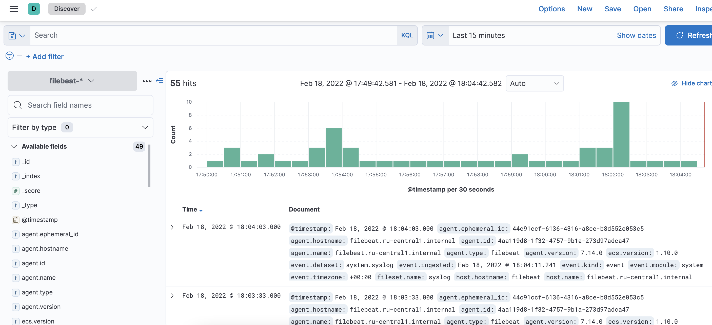

1 \
Дописал: \
```
- name: Install Kibana
  hosts: kibana
  handlers:
    - name: restart kibana
      become: true
      service:
        name: kibana
        state: restarted
  tasks:
    - name: "Download Kibana's rpm"
      get_url:
        url: "https://artifacts.elastic.co/downloads/kibana/kibana-{{ kibana_stack_version }}-x86_64.rpm"
        dest: "/tmp/kibana-{{ kibana_stack_version }}-x86_64.rpm"
      register: download_kibana
      until: download_kibana is succeeded
    - name: Install Kibana
      become: true
      yum:
        name: "/tmp/kibana-{{ kibana_stack_version }}-x86_64.rpm"
        state: present
    - name: Configure Kibana
      become: true
      template:
        src: kibana.yml.j2
        dest: /etc/kibana/kibana.yml
      notify: restart kibana
```
4 \
подготовил новый прод \
```
---
all:
  hosts:
    el-instance:
      ansible_host: 130.193.49.33
    kibana:
      ansible_host: 62.84.113.112
  vars:
    ansible_connection: ssh
    ansible_user: efomin
elasticsearch:
  hosts:
    el-instance:
kibana:
  hosts:
    kibana:
```
5,6,7,8 \
запускал с разными настройками, все работает ошибок нет elasticsearch and kibana запускаються \
 9 \
Добавил filebeat
```
- name: Instal Filebeat
  hosts: filebeat
  handlers:
    - name: restart filebeat
      become: true
      systemd:
        name: filebeat
        state: restarted
        enabled: true
  tasks:
    - name: "Download filebeat rpm"
      get_url:
        url: "https://artifacts.elastic.co/downloads/beats/filebeat/filebeat-{{ filebeat_stack_version }}-x86_64.rpm"
        dest: "/tmp/filebeat-{{ filebeat_stack_version }}-x86_64.rpm"
      register: download_filebeat
      until: download_filebeat is succeeded
    - name: Install filebeat
      become: true
      yum:
        name: "/tmp/filebeat-{{ filebeat_stack_version }}-x86_64.rpm"
        state: present
      notify: restart filebeat
    - name: Configure filebeat
      become: true
      template:
        src: filebeat.yml.j2
        dest: /etc/filebeat/filebeat.yml
      notify: restart filebeat
    - name: Set filebeat systemwork
      become: true
      command:
        cmd: filebeat modules enable system
        chdir: /usr/share/filebeat/bin
      register: filebeat_modules
      changed_when: filebeat_modules.stdout != 'Module system is already enabled'
    - name: Load Kibana dashboard
      become: true
      command:
        cmd: filebeat setup
        chdir: /usr/share/filebeat/bin
      register: filebeat_setup
      changed_when: false
      until: filebeat_setup is succeeded
```
все работает погонял со всеми флагами.
