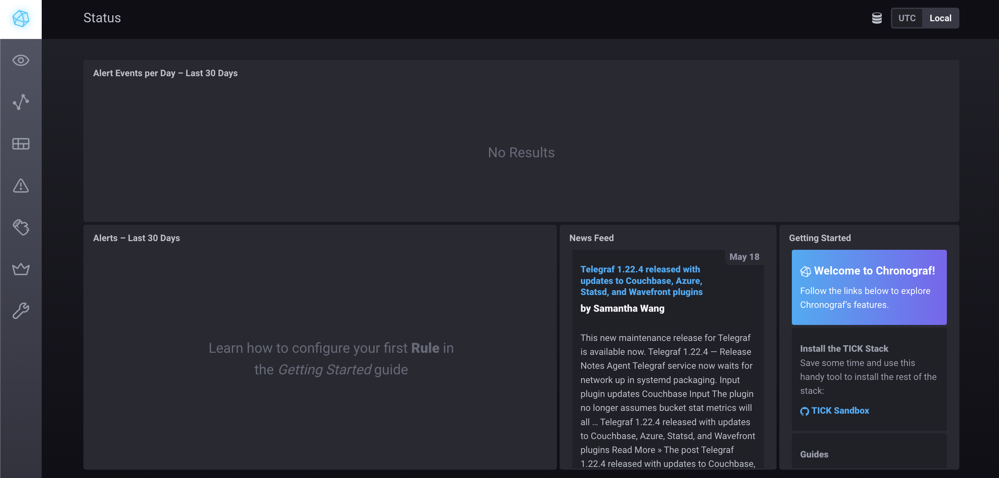
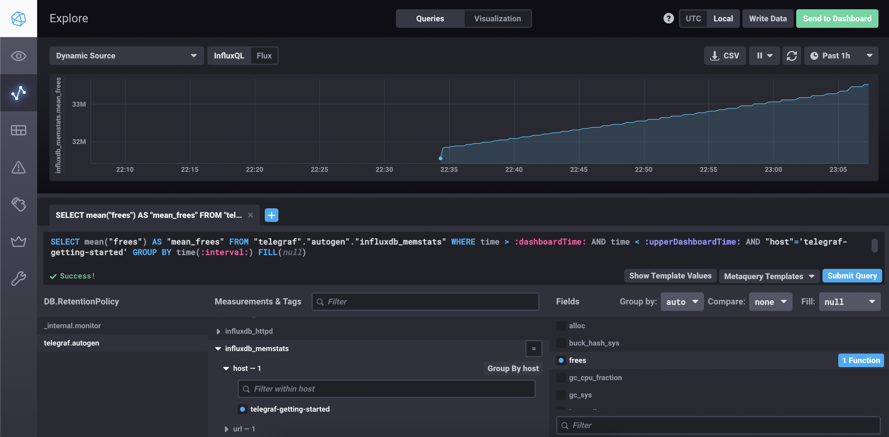
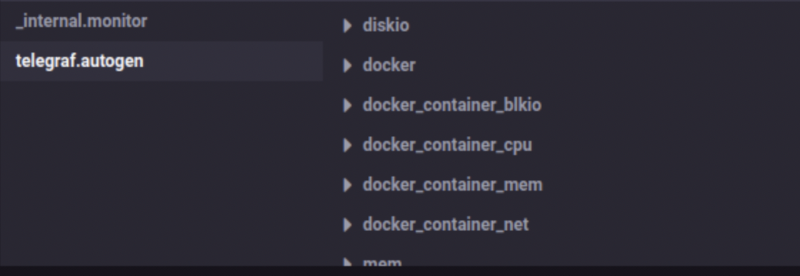

1 \
PUSH - удобна для использования в динамически создаваемых машинах (например из докер-контейнеров), 
       так как в противном случае Система мониторинга должна будет узнавать о новых хостах для их опроса,
       можно задавать глубину мониторинга именно на машинах, добавление новых иснтансов автоматом добавит метрику без настройки системы мониторинга
       Передача данных в открытом виде по сети, при наличии ПД в метриках есть риск утечки данных
       так же есть риск потери данных при недоступности системы мониторинга (принимающей метрики)
       передаваться данные должны на один ресурс для сбора (одну систему мониторинга) одним источником \
PULL - контроль над метриками с единой точки, возможность конеккта по SSL к агентам.
       более высокий уровень контроля за источниками метрик ,т.е. всегда известно кто откуда что передает,
       возможность ставить в Downtime (отключение алертинга) целых систем без потери передаваемых данных (хотя думаю в Push так же реализуемо)
       Ну и то что разными системами мониторинга можно получать одни и теже метрики, можно выподнять запросы метрики с изменяемой переодичностью 
       так же запрашивать метрики в ручном режиме в обход систем сбора 
       минус - неудобство для динамических машин (докер-контейнеры) нужно динамически собирать статистику о наличии машин, нужен дополнительный оркестратор \
А так же то что в презентации)

2 \
Prometheus - pull \
TICK - push \
Zabbix - гибрид \
VictoriaMetrics - push \
Nagios - pull \

3
```
curl http://localhost:8086/ping -v
*   Trying ::1:8086...
* Connected to localhost (::1) port 8086 (#0)
> GET /ping HTTP/1.1
> Host: localhost:8086
> User-Agent: curl/7.77.0
> Accept: */*
>
* Mark bundle as not supporting multiuse
< HTTP/1.1 204 No Content
< Content-Type: application/json
< Request-Id: daa58988-d6e2-11ec-80af-0242ac120003
< X-Influxdb-Build: OSS
< X-Influxdb-Version: 1.8.10
< X-Request-Id: daa58988-d6e2-11ec-80af-0242ac120003
< Date: Wed, 18 May 2022 19:43:56 GMT
<
* Connection #0 to host localhost left intact
```
```
curl http://localhost:8888 -v
*   Trying ::1:8888...
* Connected to localhost (::1) port 8888 (#0)
> GET / HTTP/1.1
> Host: localhost:8888
> User-Agent: curl/7.77.0
> Accept: */*
>
* Mark bundle as not supporting multiuse
< HTTP/1.1 200 OK
< Accept-Ranges: bytes
< Cache-Control: public, max-age=3600
< Content-Length: 336
< Content-Security-Policy: script-src 'self'; object-src 'self'
< Content-Type: text/html; charset=utf-8
< Etag: "3362220244"
< Last-Modified: Tue, 22 Mar 2022 20:02:44 GMT
< Vary: Accept-Encoding
< X-Chronograf-Version: 1.9.4
< X-Content-Type-Options: nosniff
< X-Frame-Options: SAMEORIGIN
< X-Xss-Protection: 1; mode=block
< Date: Wed, 18 May 2022 19:45:51 GMT
<
* Connection #0 to host localhost left intact
<!DOCTYPE html><html><head><meta http-equiv="Content-type" content="text/html; charset=utf-8"><title>Chronograf</title><link rel="icon shortcut" href="/favicon.fa749080.ico"><link rel="stylesheet" href="/src.9cea3e4e.css"></head><body> <div id="react-root" data-basepath=""></div> <script src="/src.a969287c.js"></script> </body></html>
```
```
curl http://localhost:9092/kapacitor/v1/ping -v
*   Trying ::1:9092...
* Connected to localhost (::1) port 9092 (#0)
> GET /kapacitor/v1/ping HTTP/1.1
> Host: localhost:9092
> User-Agent: curl/7.77.0
> Accept: */*
>
* Mark bundle as not supporting multiuse
< HTTP/1.1 204 No Content
< Content-Type: application/json; charset=utf-8
< Request-Id: 5d11f2ff-d6e3-11ec-80de-000000000000
< X-Kapacitor-Version: 1.6.4
< Date: Wed, 18 May 2022 19:47:34 GMT
<
* Connection #0 to host localhost left intact
```


